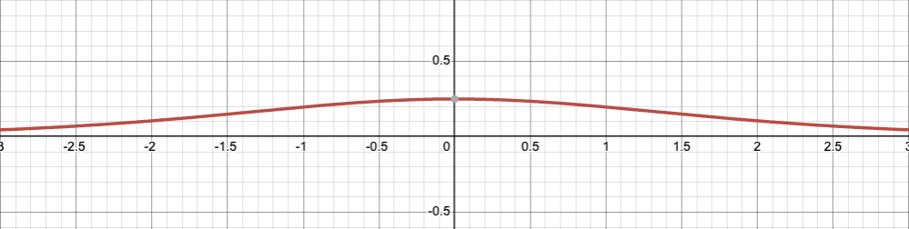
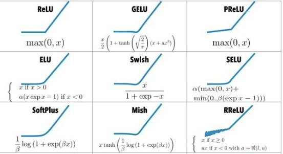

It all started with: **Deep neural networks are universial function approximators.**

## What is a unversial function approximator?

> A feed-forward artificial neural network with a single hidden layer and sigmoidal activation functions can pointwise approximate any continuous function of many variables with any predetermined accuracy.

Suppose we have a set of points $(x, y)$ and assume that there is some regularity connecting $x$ and $y$:

$$y=f(x)$$

We can select and apply to $x$ such a weighting factor $w_{1}$ and such an offset $b_1$, that the sigmoid taken from them will pass through a part of our points or close enough to them:

$$\sigma_1=\sigma(w_{1}x+b_1)$$

We can then select and apply to $x $ such $w_{2}$ and $b_2$, that the sigmoid taken from them in sum with $\sigma_ 1$ will pass still through a part of the points or close enough to them:

$$\sigma_2=\sigma(w_{2}x+b_2)$$

We can keep adding sigmoids and tinkering with their parameters until their sum approximates the pattern $f(x)$ expressed in the data accurately enough.

$$\sigma_1+\sigma_2+...+\sigma_n \approx f(x)$$

## How do they become universial function approximators?
As we all know, with just $y = (wx+b)$, we have linear regression. We know linear regressions are weak, they cannot solve XOR classification, as an example. What does the trick, is activation function. Activation functions introduce non-linearity to the model, allowing the model to fit to arbitrary functions. 

### Why we chose sigmoid()?

Sigmoid() $\sigma(x) = 1 - sigma(-x)$ function (0, 1) simulates the probability of "firing a neuron", and it has been widely used in machine learning and statistics. It was one of the easiest functions to add non-linearity as well.

### From sigmoid() to tanh()
Sigmoid() function only has positive values, it passes the same sign to update the weight matrices during back propagation, leading to inefficient gradient descent.

Tanh(), hyperbolic tangent, solves the above problem by centering at 0, so we can have both signs when updating weight. Converges faster.

### ReLU and its brothers

**Vanishing gradient problem**: As models get deeper, the gradient of the loss $\mathcal{L}$ with respect to the weights in layer $l$ can be written as:

$$ \frac{\partial \mathcal{L}}{\partial \mathbf{w}_\mathcal{L}} = \frac{\partial \mathcal{L}}{\partial \mathbf{a}_L} \times \frac{\partial \mathbf{a}_L}{\partial \mathbf{a}_{L-1}} \times ... \times \frac{\partial \mathbf{a}_{l+1}}{\partial \mathbf{a}_{l}}$$

where $\mathbf{a}_l$ is the activation at layer $l$. 

We can see that when $\partial \mathbf{a}_l$ is less than 1, (especially sigmoid, the max is only 0.25), the result approaches 0 exponentially. Our model stops learning from here.

**ReLU** is a easy stepwise funtion that mitigates this problem. Its derivative is always 1 when input is positive, and it does not saturate.

However, a rigid threshold of $y = 0(x <= 0)$ also causes problems. 
1. It "turns off" neurons with nagative weight.
    - Leaky ReLU
2. It is not differentiable at $(x = 0)$ (Same holds for Leaky)
    - GELU, Swish

## Normalization

## Optimizers

## Loss functions

