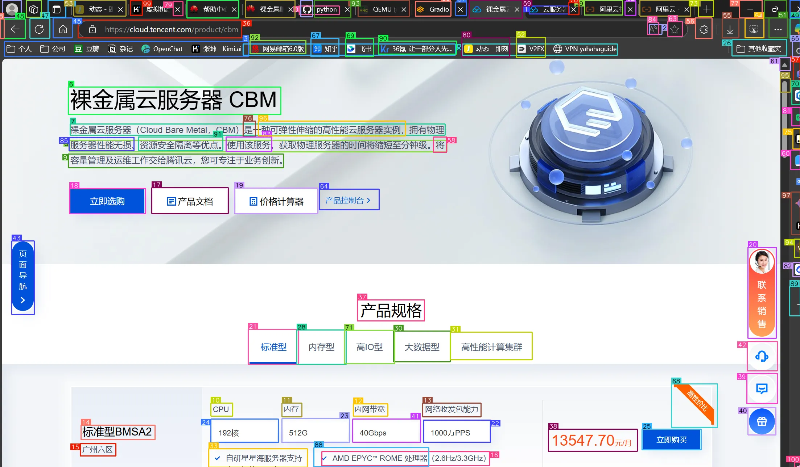

Omniparser(https://github.com/microsoft/OmniParser) provides grounding for GUI elements. This allows for fully automation and controll over devices in an agentic way.

clone the repo, and prepare the environment:
```
cd OmniParser
conda create -n "omni" python==3.12
conda activate omni
pip install -r requirements.txt
```
Model weights are here:
```
git clone https://huggingface.co/microsoft/OmniParser
git clone https://huggingface.co/microsoft/OmniParser-v2.0
```
BLIP and Florence models are in the `Omniparser` repository, while `v-2.0` has a newer YOLO detection model.

Put model weights under `OmniParser/weights/`

AutoDL 的系统盘只有30G，所以把模型权重放数据盘：
```
终端中执行：
export HF_HOME=/root/autodl-tmp/cache/

或者Python代码中执行：
import os
os.environ['HF_HOME'] = '/root/autodl-tmp/cache/'
```

OCR的语言设置在util/utils.py
```python
reader = easyocr.Reader(['en'])
paddle_ocr = PaddleOCR(
    lang='en',  # other lang also available
    use_angle_cls=False,
    use_gpu=False,  # using cuda will conflict with pytorch in the same process
    show_log=False,
    max_batch_size=1024,
    use_dilation=True,  # improves accuracy
    det_db_score_mode='slow',  # improves accuracy
    rec_batch_num=1024)
```
paddle的话，把en换成ch就是中英双语的了
easy可以设置成['ch_sim','en']

最后把端口设置转发
```
ssh -CNg -L 6006:127.0.0.1:6006 root@connect.nmb1.seetacloud.com -p 33674
```
在本地就可以运行了

